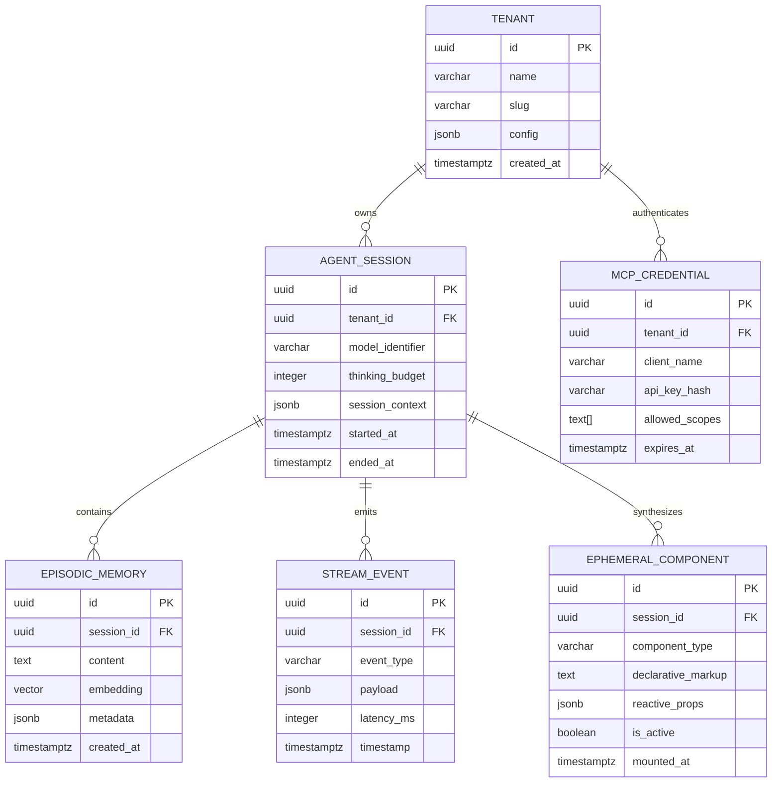

# Centaury Framework — Entity Relationship Diagram & Data Schemas (ERD)
**Database Engines**: PostgreSQL 16+ (Production with `pgvector 0.8+`) / SQLite (Local-First Edge Runtime)  
**ORM Support**: Drizzle ORM / Native SQL  

---

## 1. Relational Entity Relationship Diagram


---

## 2. Concrete Production DDL (PostgreSQL 16+ with `pgvector`)

```sql
-- Enable necessary extensions
CREATE EXTENSION IF NOT EXISTS "uuid-ossp";
CREATE EXTENSION IF NOT EXISTS "vector";

-- 1. Tenants Table
CREATE TABLE tenants (
    id UUID PRIMARY KEY DEFAULT uuid_generate_v4(),
    name VARCHAR(255) NOT NULL,
    slug VARCHAR(100) UNIQUE NOT NULL,
    config JSONB DEFAULT '{}'::jsonb,
    created_at TIMESTAMPTZ DEFAULT NOW(),
    updated_at TIMESTAMPTZ DEFAULT NOW()
);

-- 2. Agent Sessions (Dual-Citizen Execution Context)
CREATE TABLE agent_sessions (
    id UUID PRIMARY KEY DEFAULT uuid_generate_v4(),
    tenant_id UUID NOT NULL REFERENCES tenants(id) ON DELETE CASCADE,
    model_identifier VARCHAR(100) NOT NULL DEFAULT 'gemini-4-pro',
    thinking_budget INTEGER DEFAULT 16384,
    session_context JSONB DEFAULT '{}'::jsonb,
    started_at TIMESTAMPTZ DEFAULT NOW(),
    ended_at TIMESTAMPTZ
);
CREATE INDEX idx_agent_sessions_tenant ON agent_sessions(tenant_id);

-- 3. Episodic Memory (Embeddings for RAG & Past Interactions)
CREATE TABLE episodic_memories (
    id UUID PRIMARY KEY DEFAULT uuid_generate_v4(),
    session_id UUID NOT NULL REFERENCES agent_sessions(id) ON DELETE CASCADE,
    content TEXT NOT NULL,
    embedding vector(1536) NOT NULL,
    metadata JSONB DEFAULT '{}'::jsonb,
    created_at TIMESTAMPTZ DEFAULT NOW()
);
CREATE INDEX idx_episodic_embedding ON episodic_memories USING hnsw (embedding vector_cosine_ops);

-- 4. Realtime Stream Events (Telemetry, Audio, Tokens, Interruption)
CREATE TABLE stream_events (
    id UUID PRIMARY KEY DEFAULT uuid_generate_v4(),
    session_id UUID NOT NULL REFERENCES agent_sessions(id) ON DELETE CASCADE,
    event_type VARCHAR(50) NOT NULL, -- 'audio_chunk', 'token_delta', 'ephemeral_mount', 'interruption'
    payload JSONB NOT NULL,
    latency_ms INTEGER DEFAULT 0,
    timestamp TIMESTAMPTZ DEFAULT NOW()
);
CREATE INDEX idx_stream_events_session ON stream_events(session_id, timestamp DESC);

-- 5. Ephemeral Components (AI Synthesized UI History)
CREATE TABLE ephemeral_components (
    id UUID PRIMARY KEY DEFAULT uuid_generate_v4(),
    session_id UUID NOT NULL REFERENCES agent_sessions(id) ON DELETE CASCADE,
    component_type VARCHAR(100) NOT NULL,
    declarative_markup TEXT NOT NULL,
    reactive_props JSONB DEFAULT '{}'::jsonb,
    is_active BOOLEAN DEFAULT TRUE,
    mounted_at TIMESTAMPTZ DEFAULT NOW(),
    unmounted_at TIMESTAMPTZ
);
CREATE INDEX idx_ephemeral_active ON ephemeral_components(session_id, is_active);

-- 6. Model Context Protocol (MCP) Credentials
CREATE TABLE mcp_credentials (
    id UUID PRIMARY KEY DEFAULT uuid_generate_v4(),
    tenant_id UUID NOT NULL REFERENCES tenants(id) ON DELETE CASCADE,
    client_name VARCHAR(255) NOT NULL,
    api_key_hash VARCHAR(64) NOT NULL,
    allowed_scopes TEXT[] NOT NULL DEFAULT ARRAY['routes:read', 'rpc:invoke'],
    expires_at TIMESTAMPTZ,
    created_at TIMESTAMPTZ DEFAULT NOW()
);
CREATE UNIQUE INDEX idx_mcp_api_key_hash ON mcp_credentials(api_key_hash);
```

---

## 3. Local-First SQLite Schema (Edge / Zero-Config Dev Runtime)

```sql
-- SQLite equivalents for instant local dev without external database dependencies
CREATE TABLE IF NOT EXISTS local_agent_sessions (
    id TEXT PRIMARY KEY,
    model_identifier TEXT NOT NULL,
    thinking_budget INTEGER DEFAULT 8192,
    session_context TEXT DEFAULT '{}',
    started_at TEXT DEFAULT (datetime('now'))
);

CREATE TABLE IF NOT EXISTS local_ephemeral_components (
    id TEXT PRIMARY KEY,
    session_id TEXT NOT NULL,
    component_type TEXT NOT NULL,
    declarative_markup TEXT NOT NULL,
    reactive_props TEXT DEFAULT '{}',
    is_active INTEGER DEFAULT 1,
    mounted_at TEXT DEFAULT (datetime('now')),
    FOREIGN KEY(session_id) REFERENCES local_agent_sessions(id)
);
```
