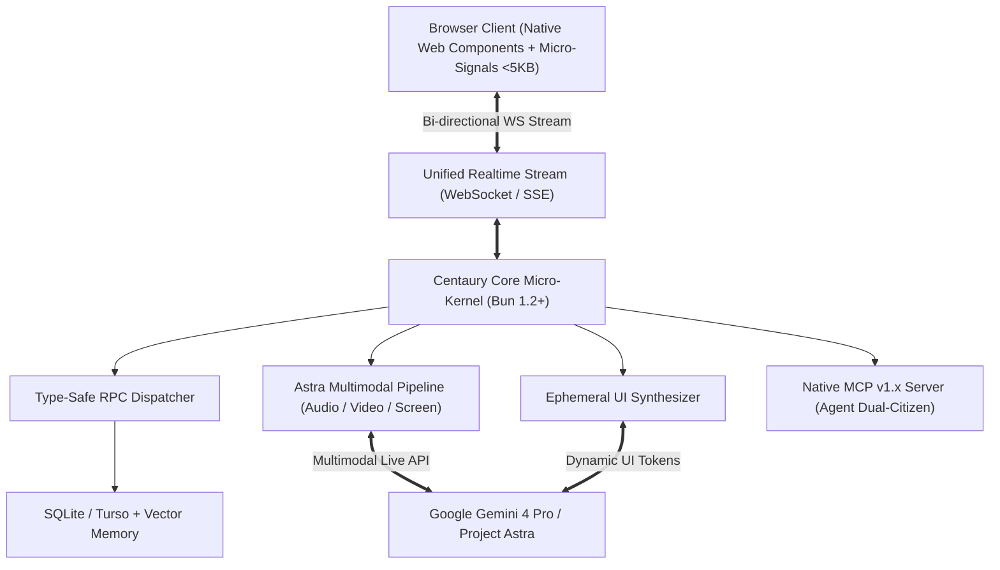

# Product Requirements Document (PRD) — Centaury Framework
**Project**: Centaury Framework (`@centaury/core`)  
**Version**: 1.0.0-alpha  
**Status**: Approved  
**Author**: Antigravity Principal Architect & Roedy Rustam  
**Created**: 2026-10-07  
**Last Updated**: 2026-10-07  

---

## 1. Executive Summary
Centaury is an autonomous, ultra-lightweight fullstack web and agentic framework built for the era of Super-Intelligence (ASI) and frontier AI reasoning models (Google Gemini 4 Pro and Project Astra). Unlike legacy human-only frameworks (Next.js, Remix, Astro) that treat AI as a secondary bolt-on copilot, Centaury is architected from the ground up as a **Dual-Citizen Autonomous Engine** where AI agents and human developers share identical runtime introspection, live AST manipulation, and streaming interfaces. Centaury delivers sub-5ms cold starts on Bun/WASM, a <5KB zero-hydration client micro-signals runtime, native real-time bidirectional multimodal streaming, and on-the-fly **Ephemeral UI** generation.

---

## 2. Problem Statement
* **Current Framework Bottlenecks**:
  1. **Heavy Hydration Overhead**: Legacy React/Next.js runtimes force 80KB-200KB+ client JS bundles, causing hydration mismatches, sluggish INP (>200ms), and complex RSC compilation barriers.
  2. **Passive Codebases**: Modern frameworks are static filesystems incapable of self-reflection, live schema introspection, or runtime code healing by autonomous agents.
  3. **Lack of Native Multimodal & Ephemeral Streaming**: Building real-time voice, vision, and dynamic AI-generated UI requires stitching together dozens of disparate libraries (WebSockets, WebRTC, custom parsers, error-prone streaming wrappers).
  4. **AI-Slop & Abstraction Bloat**: Endless configuration files, transpilation layers, and boilerplate code slow down both developers and AI agent context windows.

* **Target Users**:
  * AI Engineers & Fullstack Developers building next-generation agentic applications.
  * Autonomous AI Swarms & Coding Agents needing direct, type-safe introspection without fragile web scraping.
  * High-performance web applications demanding instant cold starts, zero-hydration UI, and sub-100ms conversational AI latency.

---

## 3. Goals & Success Metrics
| Goal | Metric | Target |
|---|---|---|
| Runtime Cold Start | Bun HTTP/WebSocket micro-kernel initialization | < 5 ms |
| Client Runtime Size | Core Micro-Signals + Web Components bundle | < 5 KB gzipped |
| Interaction to Next Paint (INP) | Browser interaction latency | < 50 ms (Zero hydration blocking) |
| Multimodal Astra Interruption Latency | Gemini Live bidirectional audio/screen pipeline | < 150 ms |
| Ephemeral UI Stream Rendering | Streaming synthetic component tokens to DOM | Zero compilation step, real-time incremental mounting |
| Codebase Token Footprint | Complete framework core context window ingestion | Fits within <20k tokens (100% KV-Cache friendly) |

---

## 4. User Personas
### Persona 1: The Frontier AI Builder (Human Dev)
- **Role**: Staff Fullstack Engineer building real-time cognitive applications.
- **Goals**: Build multimodal voice/screen AI apps and generative UIs without wrestling with Webpack, RSC hydration errors, or complex server action boundaries.
- **Frustrations**: Next.js bundle sizes, fragile streaming boundaries, high maintenance overhead.

### Persona 2: The Autonomous Reasoning Agent (AI Citizen)
- **Role**: Google Gemini 4 Pro / Super-Intelligent Autonomous Agent.
- **Goals**: Introspect application routes, call type-safe RPC actions, diagnose runtime exceptions via AST, and synthesize ephemeral UI components directly onto the client DOM.
- **Frustrations**: Minified bundle walls, opaque server states, fragile DOM scraping.

---

## 5. Feature Requirements

### MVP Features (Must Have — v1.0)
1. **Core Micro-Kernel Engine (`@centaury/core`)**:
   - High-throughput Bun native HTTP and WebSocket server.
   - Built-in type-safe RPC router (`centaury.rpc`) without build-step codegen.
   - Native static asset server with Brotli/Gzip compression and zero-copy transfers.
2. **Zero-Hydration UI Engine (`@centaury/ui`)**:
   - Micro-Signals (<1.5KB) with fine-grained reactive DOM binding.
   - Standard Web Components primitives (`<c-stack>`, `<c-stream>`, `<c-ephemeral>`).
   - Native CSS 2026 support (Anchor Positioning, `@starting-style`, View Transitions Level 2).
3. **Autonomous Ephemeral UI Engine (`@centaury/ephemeral`)**:
   - Streaming parser for synthetic UI tokens emitted by LLMs.
   - Sandboxed, secure runtime DOM injection without client compilation.
4. **Multimodal Astra Gateway (`@centaury/astra`)**:
   - Bi-directional audio/video WebSockets connector for Gemini Multimodal Live API.
   - Sub-150ms interruption handling and live screen-grounding coordinates mapping.
5. **Agentic Introspection & MCP v1.x Server (`@centaury/agent`)**:
   - Built-in Model Context Protocol endpoint (`/.well-known/mcp.json`).
   - Exposes live route schemas, database queries, and log streams directly to AI agents.

### Phase 2 Features (v1.x)
- Embedded WASM Small Language Model (SLM) runner for local-first zero-latency edge inference.
- Autonomous self-healing runtime with AST diff generation upon uncaught server exceptions.

---

## 6. Technical Architecture & Technology Stack
| Layer | Technology | Rationale |
|---|---|---|
| **Runtime Engine** | Bun 1.2+ & TypeScript 5.8+ | Sub-5ms startup, native WebSocket/HTTP, zero transpiler lag. |
| **WASM Core** | Rust compiled to WebAssembly | High-speed cryptographic validation, token parsing, and secure isolation. |
| **Frontend Reactive** | Centaury Micro-Signals | Pure reactivity without Virtual DOM; updates DOM nodes at atomic precision. |
| **UI Primitives** | Native Web Components & CSS 2026 | No framework vendor lock-in, zero hydration overhead, ultra-fast browser rendering. |
| **AI Frontier** | Gemini 4 Pro & Project Astra | Flagship System-2 reasoning (thinking budget up to 64k) + low-latency multimodal live streaming. |
| **Storage & Memory** | Embedded SQLite / Turso + pgvector | Zero-config local persistence, vector embeddings for episodic agent memory. |

---

## 7. High-Level Data Model & Architecture Diagram

---

## 8. User & System Flows

### Flow 1: Real-time Ephemeral UI Generation
1. Client requests an adaptive interface based on dynamic user task context.
2. Centaury Server routes prompt with deterministic KV-cache prefix to Gemini 4 Pro.
3. Model streams semantic UI tokens over the Unified Realtime Stream.
4. Client `<c-ephemeral>` custom element parses tokens in real-time, mounting reactive native elements with micro-signals and zero client compilation.

### Flow 2: Project Astra Bidirectional Multimodal Interaction
1. Client streams user microphone audio & screen canvas frames over Centaury WebSocket.
2. Centaury Astra Gateway streams raw chunks directly to Gemini Multimodal Live API.
3. Model interrupts immediately upon user speech and returns sub-150ms audio response and screen grounding coordinates.
4. Centaury client renders visual bounding overlays via Native CSS 2026 Anchor Positioning.

---

## 9. Non-Functional Requirements (NFRs)
* **Performance**: First Contentful Paint (FCP) < 0.4s, LCP < 0.8s, CLS = 0.
* **Security**: Zero `eval()` in client runtime; all Ephemeral UI components undergo strict sanitizer validation; native CORS & CSRF token protection.
* **Accessibility**: Full WCAG 2.2 AAA conformance; automatic ARIA tree emission for dynamic ephemeral elements.
* **Token Efficiency**: Clean deterministic prompt schemas ensuring 90%+ KV-Cache hit rate on frontier models.

---

## 10. Out of Scope (Non-Goals for v1.0)
* No support for legacy bundlers (Webpack, Babel).
* No legacy Virtual DOM rendering engines (React 17/18 classic class components).
* No monolithic legacy relational ORM bloat (avoiding 50MB node_modules footprints).
