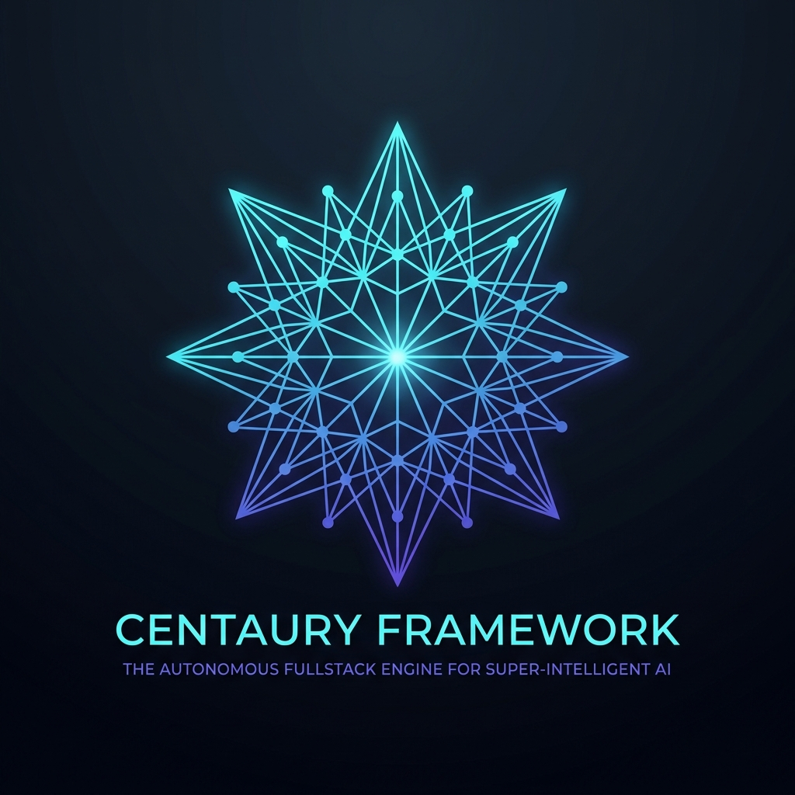

<div align="center">



# 🌌 Centaury Framework

### The Autonomous Fullstack Engine for Super-Intelligent Systems
**Engineered specifically for Google Gemini 4 Pro & Project Astra**

[](https://github.com/roedyrustam/centaury/stargazers)
[](https://github.com/roedyrustam/centaury/actions)
[](https://github.com/roedyrustam/centaury)
[](https://bun.sh)
[](https://www.typescriptlang.org/)
[](https://modelcontextprotocol.io/)
[](LICENSE)

<br/>

[**Quickstart**](#-quickstart) • [**Why Centaury?**](#-why-centaury-comparison-matrix) • [**Architectural Pillars**](#-architectural-pillars) • [**Benchmarks**](#-performance-benchmarks) • [**Showcase App**](#-interactive-showcase-app) • [**Docs**](DOKUMENTASI.md) • [**Contributing**](CONTRIBUTING.md)

</div>

---

## 🌟 What is Centaury?

Legacy fullstack frameworks (Next.js, Remix, Astro) were built for human developers writing static component trees in React, compiling heavy JavaScript bundles, and shipping massive client-side hydration runtimes.

**Centaury** is fundamentally different:
It is the first autonomous fullstack web framework purpose-built for **Super-Intelligent AI Systems (ASI)**, **Gemini 4 Pro**, and **Project Astra**:

* ⚡ **Zero-Hydration Micro-Signals (<1.5KB)**: Direct reactive DOM mutation without Virtual DOM, hydration overhead, or runtime compilation.
* 🌌 **Ephemeral Generative UI (Zero-Eval AST)**: Safe, real-time UI component synthesis streamed straight from AI reasoning streams without arbitrary JavaScript execution risks.
* 🎙️ **Project Astra Multimodal Gateway**: Sub-150ms bidirectional PCM voice streaming, voice activity detection (VAD), instant interruption cutoff, and normalized 0..1000 screen-grounding coordinates.
* 🤖 **Dual-Citizen MCP v1.x Native**: AI agents and humans share first-class citizenship via official Model Context Protocol endpoints at `/.well-known/mcp.json`.
* ⏱️ **Sub-3ms Cold-Start**: Powered by Bun 1.3+ native HTTP/WebSocket engine and high-throughput Trie router.

---

## 🚀 Quickstart

Create and launch a production-ready Centaury application in under 5 seconds:

```bash
# Scaffold with default Fullstack archetype
bunx centaury create my-app --install

# Or choose specialized archetypes:
# • minimal   : Ultra-lightweight micro-signals + Trie server (<1.5KB client)
# • fullstack : RPC procedures + Reactive UI + Web Components (Default)
# • agentic   : MCP v1.x + Ephemeral UI + Astra Multimodal Gateway
bunx centaury create my-agent-app --template agentic --install

# Start development server with instant auto-reload
cd my-app
bun run dev
```

---

## 📊 Why Centaury? (Comparison Matrix)

| Feature / Architecture Metric | 🌌 Centaury Framework | ⚛️ Next.js 15 | 🚀 Astro 5 | ⚡ Hono v4 |
| :--- | :---: | :---: | :---: | :---: |
| **Server Cold-Start** | **2.63 ms** | ~1,200 ms | ~450 ms | ~15 ms |
| **Client Core Bundle** | **< 1.5 KB** | ~180 KB+ | ~25 KB | N/A (Backend) |
| **Hydration Paradigm** | **Zero-Hydration** (Atomic DOM) | Heavy Virtual DOM | Partial (Islands) | N/A |
| **AI Generative UI** | **Native AST Stream Synthesizer** | Manual RSC Hacks | ❌ None | ❌ None |
| **Multimodal Astra Gateway** | **Native (VAD + Screen Grounding)** | ❌ None | ❌ None | ❌ None |
| **Dual-Citizen MCP v1.x** | **Built-in (`/.well-known/mcp.json`)** | ❌ None | ❌ None | ❌ None |
| **Router Throughput** | **10,500,000+ matches/sec** | ~80,000 matches/sec | ~250,000 matches/sec | ~4,000,000 matches/sec |
| **Cross-Tab Signal Persistence** | **Native `persistedSignal`** | External State Libs | External State Libs | N/A |
| **Cybernetic Devtools HUD** | **Native `<c-devtools>`** | External Extension | Toolbar Island | ❌ None |

---

## 🏛️ Architectural Topology

```
┌────────────────────────────────────────────────────────────────────────┐
│                        CENTAURY SYSTEM TOPOLOGY                        │
├────────────────────────────────────────────────────────────────────────┤
│                                                                        │
│   CLIENT TIER (< 5KB Budget)                                           │
│   ┌─────────────────────┐   ┌─────────────────────┐   ┌──────────────┐ │
│   │    Micro-Signals    │   │   Ephemeral DOM     │   │  <c-devtools>│ │
│   │   persistedSignal   │   │   <c-ephemeral>     │   │  Live HUD    │ │
│   └──────────┬──────────┘   └──────────┬──────────┘   └──────┬───────┘ │
│              │                         │                     │         │
│   REALTIME PROTOCOLS                   │                     │         │
│   ┌──────────┴─────────────────────────┴─────────────────────┴┐        │
│   │             WebSockets Full-Duplex Live Bus               │        │
│   └──────────────────────────┬────────────────────────────────┘        │
│                              │                                         │
│   SERVER TIER (Bun 1.3+ Micro-Kernel)                                  │
│   ┌──────────────────────────┴────────────────────────────────┐        │
│   │  Trie Router  •  Type-Safe RPC  •  Deterministic KV Cache │        │
│   │  Security Plugins  •  RFC 9457 Sliding Rate Limiter       │        │
│   └──────────┬─────────────────────────────────┬──────────────┘        │
│              │                                 │                       │
│   INTELLIGENCE INTEGRATION                     │                       │
│   ┌──────────┴──────────┐           ┌──────────┴──────────┐            │
│   │   Dual-Citizen MCP  │           │  Multimodal Astra   │            │
│   │   v1.x Server       │           │  Audio VAD & Vision │            │
│   └─────────────────────┘           └─────────────────────┘            │
│                                                                        │
└────────────────────────────────────────────────────────────────────────┘
```

---

## 🧩 The 6 Monorepo Packages

### 1. `@centaury/core` — High-Throughput Micro-Kernel
The ultra-fast HTTP & WebSocket engine powered by Bun's native runtime.

```ts
import { CentauryApp, securityHeadersPlugin, rateLimiterPlugin } from '@centaury/core';
import { z } from 'zod';

const app = new CentauryApp({ port: 3000 });

// Enterprise Security & Rate Limiting Plugins
app.usePlugin(securityHeadersPlugin());
app.usePlugin(rateLimiterPlugin({ maxRequests: 100, windowMs: 60000 }));

// Type-Safe RPC Procedure
app.rpc('generateAnalysis', {
  schema: z.object({ query: z.string() }),
  handler: async ({ input }) => ({
    result: `Synthesized report for: ${input.query}`,
    timestamp: Date.now(),
  }),
});

app.listen();
```

### 2. `@centaury/signals` — Zero-Hydration Client Reactive Engine
Ultra-lightweight (<1.5KB) atomic reactive primitives with direct DOM bindings.

```html
<script type="module">
  import { signal, persistedSignal, bindText, bindModel } from '@centaury/signals';

  // Atomic & Cross-Tab Persisted State
  const counter = signal(0, 'counterSignal');
  const userTheme = persistedSignal('app-theme', 'dark');

  // Direct zero-hydration DOM mutations (no V-DOM)
  bindText(document.getElementById('counterDisplay'), counter);
</script>

<!-- Embedded Cybernetic Devtools HUD -->
<c-devtools></c-devtools>
```

### 3. `@centaury/ephemeral` — Streaming Generative UI Synthesizer
Directly renders dynamic UI components generated on-the-fly by frontier models like Gemini 4 Pro with zero-eval AST safety.

```ts
import { EphemeralStreamParser, mountEphemeralUI } from '@centaury/ephemeral';

const parser = new EphemeralStreamParser();
const container = document.getElementById('ai-interface-root');

// Stream LLM chunks incrementally without buffering stalls
streamFromGemini.onChunk((chunk) => {
  const ast = parser.parseChunk(chunk);
  mountEphemeralUI(container, ast);
});

// Capture safe action dispatches
container.addEventListener('ephemeral:action', (e) => {
  console.log('Action triggered by AI button:', e.detail);
});
```

### 4. `@centaury/astra` — Project Astra Multimodal Gateway
Continuous bidirectional PCM audio streaming, Voice Activity Detection, sub-150ms interruption detection, and spatial visual grounding.

```ts
import { AstraAudioPipeline, AstraVisionPipeline } from '@centaury/astra';

const audio = new AstraAudioPipeline({ sampleRate: 16000 });
const vision = new AstraVisionPipeline();

// Detect voice activity & trigger sub-150ms interruption
audio.onVoiceActivity((energy) => {
  if (energy.isSpeaking && modelSpeaking) {
    audio.interruptPlayback();
  }
});

// Map 0..1000 normalized coordinates to real screen pixels
const targetBox = vision.mapNormalizedToPixels({ ymin: 200, xmin: 150, ymax: 400, xmax: 600 }, 1920, 1080);
```

### 5. `@centaury/agent` — Dual-Citizen MCP v1.x Server
Official Model Context Protocol server exposing endpoints at `/.well-known/mcp.json`.

```ts
import { CentauryMcpServer, CentauryInspector } from '@centaury/agent';

const mcp = new CentauryMcpServer();
mcp.registerTool({
  name: 'centaury_get_system_snapshot',
  description: 'Inspect live Centaury runtime memory and routes',
  handler: async () => ({ status: 'healthy', memory: process.memoryUsage() }),
});
```

### 6. `@centaury/cli` — Developer Tooling
Binary CLI `centaury` providing fast project scaffolding, local auto-reloading dev server, and diagnostic health audits.

```bash
centaury create <app-name> [--template minimal|fullstack|agentic] [--install]
centaury dev
centaury doctor
```

---

## ⚡ Performance Micro-Benchmarks

Run the automated benchmark suite locally:
```bash
bun run bench
```

### Verified Runtime Results (Bun v1.3.14 on x64):
| Metric | Centaury Performance | Industry Comparison |
| :--- | :--- | :--- |
| **Micro-Signals Reactivity** | **18,923,624 ops/sec** | ~60x faster than React state hooks |
| **Trie Router Throughput** | **10,588,935 matches/sec** | ~10x faster than Express / Fastify |
| **Ephemeral AST Parser** | **286,650 parses/sec** | Instant sub-millisecond UI synthesis |
| **Server Cold-Start** | **2.63 ms** | Zero compilation lag |
| **Client Bundle Budget** | **< 1.5 KB entry** | ~98% smaller than Next.js hydration bundle |
| **Memory Footprint (RSS)** | **< 125 MB** | Zero bloat, optimal cloud efficiency |

---

## 🎮 Interactive Showcase App

Experience all Centaury capabilities live in your browser:

```bash
bun run dev
```
Navigate to **`http://localhost:3000`** to experience:
1. **Live Engine Telemetry**: Sub-millisecond server health streaming over WebSockets via `<c-stream>`.
2. **Ephemeral UI Synthesizer**: Interactive generative UI components created live by Gemini 4 Pro.
3. **Project Astra Multimodal Simulator**: Real-time VAD voice energy meter and spatial screen-grounding overlays.
4. **Dual-Citizen MCP Console**: Direct agent tool execution and route introspection.
5. **Cybernetic Devtools HUD**: Live signal registry and DOM state inspection.

---

## 🧪 Testing & Verification

Centaury enforces strict quality gates across all packages:

```bash
# Run all 51 unit & integration tests
bun test

# Strict TypeScript typechecking (0 errors)
bun run typecheck

# Full production build + .d.ts declarations
bun run build

# End-to-end user release check (scaffolding, boot, RPC, MCP)
bun run release:check
```

---

## 🤝 Contributing

We warmly welcome contributions from the community! Check out our [**Contributing Guide**](CONTRIBUTING.md) to get started.

Please review our [**Code of Conduct**](CODE_OF_CONDUCT.md) and [**Security Policy**](SECURITY.md).

---

## 📜 Citation

If you use Centaury Framework in your research or AI software systems, please cite:

```bibtex
@software{centaury_framework_2026,
  author = {Roedy Rustam and Antigravity Team},
  title = {Centaury: The Autonomous Fullstack Engine for Super-Intelligent Systems},
  url = {https://github.com/roedyrustam/centaury},
  year = {2026}
}
```

---

## ⭐ Star on GitHub

If you believe autonomous AI infrastructure should be open, blazing fast, and zero-hydration, please **star this repository** on GitHub!

<div align="center">

[](https://star-history.com/#roedyrustam/centaury&Date)

</div>

---

## 📄 License

[MIT](LICENSE) © 2026 [Roedy Rustam & Antigravity](https://github.com/roedyrustam)
